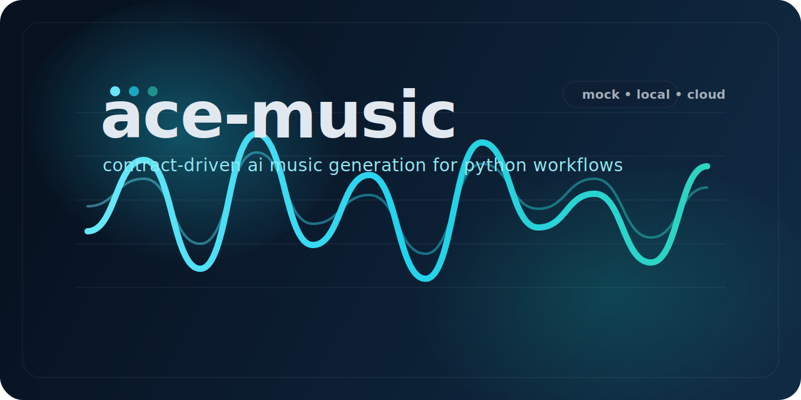

# ace-music

[English](README.md)



面向 Python 工作流、自动化流水线和场景化配乐生成的契约驱动式 AI 音乐生成工具。

## 为什么使用 ace-music

`ace-music` 是一个用于生成和校验音乐输出的 Python 包，适合脚本化、自动化和场景驱动的音频工作流。它提供：

- 带机器可读 JSON 摘要的 CLI
- 适合烟雾测试和 CI 的 mock 模式
- 面向本地 GPU 的 ACE-Step 路径
- 面向云端的 MiniMax 路径
- 适合编排系统接入的结构化输入契约

## 功能特性

- 稳定 CLI：提供 `generate` 和 `validate` 命令，并定义清晰退出码。
- 多种后端：mock、本地 ACE-Step、MiniMax。
- 结构化契约：`PipelineInput`、`AudioSceneContract`、`DirectorBridge`。
- 自动化友好：JSON 摘要、校验元数据、可预测输出路径。
- 可测试的发布表面：无需 GPU 即可用 mock 模式完成贡献验证。

## 快速开始

最短成功路径使用 mock 模式，不需要 GPU：

```bash
python -m venv .venv
source .venv/bin/activate
pip install -e ".[dev]"
ace-music generate \
  --mock \
  --description "short jazz improvisation" \
  --duration 5 \
  --output-dir ./output \
  --summary-json ./output/last-run.json
```

运行后你会得到一个生成的 WAV 文件，以及写入 `./output/last-run.json` 的 JSON 摘要。

## 安装

开发与 mock 模式安装：

```bash
python -m venv .venv
source .venv/bin/activate
pip install -e ".[dev]"
```

可选的 GPU 相关依赖：

```bash
pip install -e ".[dev,model]"
```

`.[model]` 只安装本项目侧需要的 Python GPU/音频依赖。ACE-Step 运行时本身仍然需要你在目标机器上单独安装和配置，因此这个 extra 不会进入公共 CI。

## 运行模式

| 模式 | 适用场景 | 要求 |
| --- | --- | --- |
| Mock | 烟雾测试、CI、首次验证 | 无 GPU |
| 本地 ACE-Step | 本地高质量生成 | 兼容 GPU 与模型环境 |
| MiniMax | 云端生成 | `MINIMAX_API_KEY` |

## CLI 示例

生成音频：

```bash
ace-music generate \
  --mock \
  --description "dreamy synthwave with warm pads" \
  --duration 10 \
  --output-dir ./output \
  --summary-json ./output/run.json
```

直接校验生成出来的 WAV：

```bash
ace-music validate ./output/path-to-generated.wav \
  --expected-sample-rate 48000 \
  --expected-duration 10 \
  --duration-tolerance 5
```

## Python 示例

```python
import asyncio

from ace_music.agent import MusicAgent
from ace_music.schemas.pipeline import PipelineInput
from ace_music.tools.generator import GeneratorConfig


async def main() -> None:
    agent = MusicAgent(generator_config=GeneratorConfig(mock_mode=True))
    result = await agent.run(
        PipelineInput(
            description="A dreamy synthwave track about neon cities",
            duration_seconds=20.0,
            output_dir="./output",
        )
    )
    print(result.audio_path)


asyncio.run(main())
```

## 架构

```text
MusicAgent
  -> LyricsPlanner
  -> StylePlanner
  -> Generator or MiniMaxMusicGenerator
  -> PostProcessor
  -> OutputWorker
```

默认流程是分阶段、契约驱动的。更多细节见 [docs/audio-engine-architecture.md](docs/audio-engine-architecture.md)。

## 文档

- [验证指南](docs/MUSIC_ENGINE_VALIDATION.md)
- [架构说明](docs/audio-engine-architecture.md)

## 常见问题

### 安装后出现 `ModuleNotFoundError`

先激活虚拟环境，再重新安装：

```bash
source .venv/bin/activate
pip install -e ".[dev]"
```

### CUDA 或 GPU 不可用

烟雾测试请使用 `--mock`。如果要运行本地 ACE-Step，请安装 `.[model]`、单独配置 ACE-Step 运行时，并在支持 CUDA 的机器上执行。

### 缺少 `MINIMAX_API_KEY`

使用 MiniMax 后端前先导出环境变量：

```bash
export MINIMAX_API_KEY="your-key"
```

在 macOS 上，CLI 会对云端生成路径使用 `spawn` worker 上下文，以避免某些 Objective-C 相关库在 `fork()` 后崩溃。

### mock 模式和生产结果差异很大

这是预期行为。mock 模式用于 CLI 验证、自动化检查和贡献工作流，不用于音质评估。

## 参与贡献

贡献环境、质量门禁与 PR 要求见 [CONTRIBUTING.md](CONTRIBUTING.md)。

## 许可证

MIT，见 [LICENSE](LICENSE)。
